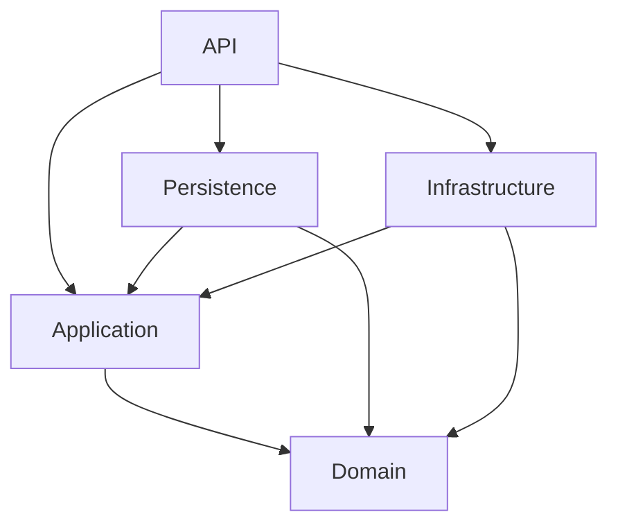
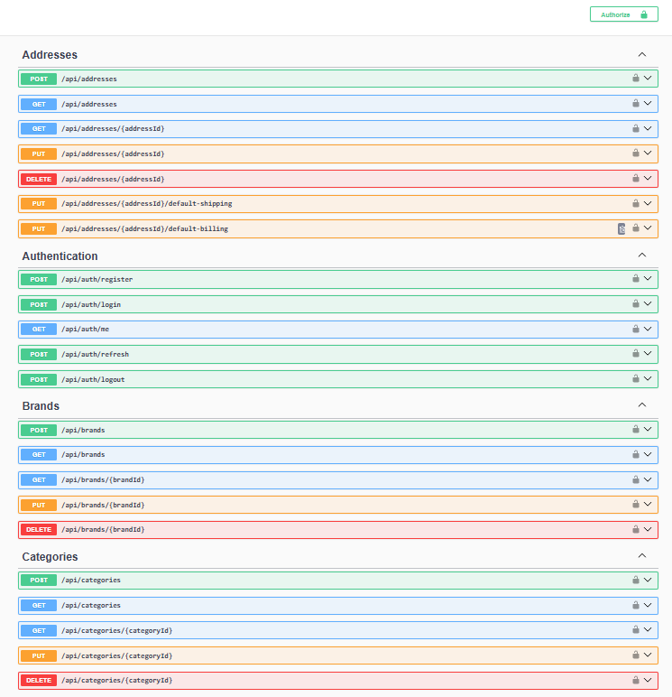
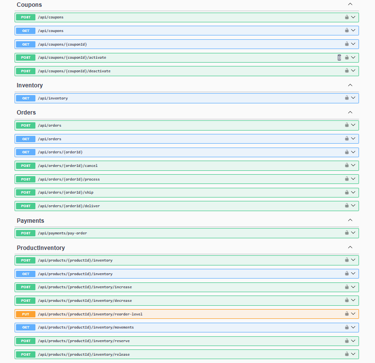
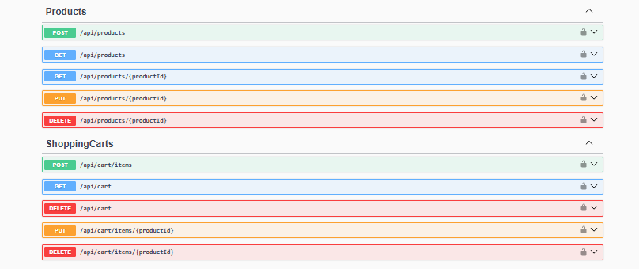
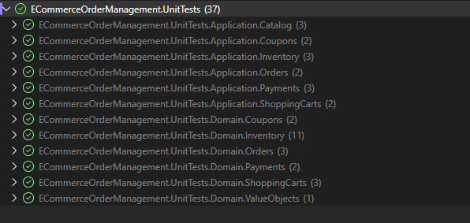

# 🚀 E-Ticaret Sipariş Yönetimi API — Clean Architecture (.NET 10)

Ürün, stok, alışveriş sepeti, sipariş ve ödeme süreçlerini yönetmek için ASP.NET Core ve .NET 10 ile geliştirilmiş bir REST API projesidir.

Bu projeyi Clean Architecture, domain kuralları, CQRS ve harici servis entegrasyonlarıyla backend geliştirme pratiği yapmak için geliştirdim. Projede stok rezervasyonu, kupon doğrulama, JWT ile kimlik doğrulama, ödeme işlemleri ve asenkron e-posta bildirimleri bulunur.

---

## 📌 Projenin Özellikleri

| Alan | İşlevler |
| --- | --- |
| Kimlik doğrulama | Kayıt, giriş, JWT erişim token'ları, refresh token ve çıkış işlemleri |
| Katalog | Ürün, kategori ve marka yönetimi; filtreleme ve sayfalama ile ürün listeleme |
| Stok | Stok artırma ve azaltma, rezervasyon, rezervasyon serbest bırakma, yeniden sipariş seviyeleri ve hareket geçmişi |
| Adresler | Müşteri adresleri, varsayılan teslimat ve fatura adresi tercihleri |
| Alışveriş sepeti | Ürün ekleme, miktar güncelleme ve ürün silme; kullanılabilir stok kontrolü |
| Siparişler | Sepetten sipariş oluşturma, ürün ve adres bilgilerinin sipariş anındaki kopyalarını saklama, sipariş durumunu yönetme |
| Kuponlar | Yüzdelik ve sabit tutarlı indirimler, geçerlilik tarihleri, minimum sipariş tutarı ve kullanım limitleri |
| Ödemeler | Iyzico entegrasyonu, başarılı ve başarısız ödeme kayıtları, mevcut başarılı ödeme kontrolü |
| Bildirimler | Başarılı ödeme olayları, veritabanında outbox kayıtları, RabbitMQ ve MailKit ile e-posta gönderimi |

---

## 🛠️ Kullanılan Teknolojiler

| Teknoloji | Kullanım amacı |
| --- | --- |
| .NET 10 / ASP.NET Core Web API | HTTP endpoint'leri ve uygulama altyapısı |
| Entity Framework Core / SQL Server | Veri erişimi, yapılandırmalar ve migration'lar |
| ASP.NET Core Identity / JWT | Kullanıcı yönetimi ve kimlik doğrulama |
| MediatR | Command ve query işlemlerinin handler'lara yönlendirilmesi |
| FluentValidation | İstek doğrulama |
| RabbitMQ | Asenkron mesajlaşma |
| Iyzico | Ödeme entegrasyonu |
| MailKit | SMTP üzerinden e-posta gönderimi |
| Swagger / OpenAPI | API dokümantasyonu ve endpoint'leri deneme |
| xUnit / Moq / coverlet.collector | Unit testler, mock nesneler ve kod kapsamı toplama |
| Docker / Docker Compose | API, SQL Server ve RabbitMQ'nun birlikte çalıştırılması |

NuGet paket sürümleri `Directory.Packages.props` dosyasında merkezi olarak yönetilir. DTO ve domain nesneleri arasındaki dönüşümler kod içinde açıkça yapılır.

---

## 🧱 Proje Mimarisi

Uygulama, sorumlulukları ayrı projelere ayıran Clean Architecture yaklaşımını kullanır.

Aşağıdaki oklar projelerin birbirine olan referanslarını gösterir:



### 🔹 Domain

`src/ECommerceOrderManagement.Domain`

- Entity ve aggregate root sınıfları
- `Money` gibi value object'ler
- Stok rezervasyonu ve sipariş durum geçişleri gibi iş kuralları
- Domain event'ler

### 🔹 Application

`src/ECommerceOrderManagement.Application`

- MediatR command, query ve handler'ları
- Repository, ödeme, kimlik doğrulama ve diğer servis interface'leri
- Request/response modelleri ve DTO'lar
- FluentValidation validator'ları ve validation pipeline
- `Result` ve `Result<T>` modelleri

### 🔹 Persistence

`src/ECommerceOrderManagement.Persistence`

- Uygulama DbContext'i ve EF Core entity yapılandırmaları
- Repository ve sorgu implementasyonları
- Unit of Work ve transaction yönetimi
- Uygulama migration'ları
- Audit bilgileri, soft delete interceptor'ı ve outbox kayıtları

### 🔹 Infrastructure

`src/ECommerceOrderManagement.Infrastructure`

- ASP.NET Core Identity ve Identity migration'ları
- JWT üretimi ve refresh token işlemleri
- Iyzico ödeme entegrasyonu
- MailKit ile e-posta gönderimi
- RabbitMQ publisher ve consumer yapıları
- Outbox arka plan servisi

### 🔹 API

`src/ECommerceOrderManagement.API`

- Controller'lar ve HTTP istek/yanıt modelleri
- Authentication ve authorization pipeline
- Global exception handler ve Problem Details yanıtları
- Swagger ve dependency injection yapılandırması

### 🔹 Test Projeleri

| Proje | Kapsam |
| --- | --- |
| `tests/ECommerceOrderManagement.UnitTests` | Domain kuralları ve application handler davranışları |
| `tests/ECommerceOrderManagement.IntegrationTests` | SQL Server üzerinde eşzamanlılık kontrolleri |

Domain projesi diğer uygulama projelerine bağımlı değildir. Application katmanındaki handler'lar interface'leri kullanır; bu interface'lerin uygulamaları Persistence ve Infrastructure katmanlarında bulunur. Command ve query işlemleri, tek bir API uygulaması içinde MediatR ile ayrılır.

---

## 🔄 Sipariş ve Ödeme Akışı

1. Müşteri sepete ürün ekler. Ürün eklenirken veya miktar güncellenirken kullanılabilir stok kontrol edilir.
2. Sipariş oluşturulurken sepet, müşteriye ait adresler, aktif ürünler ve kullanılabilir stok tekrar kontrol edilir. Kupon kullanılıyorsa geçerlilik tarihleri, minimum tutar ve kullanım limitleri doğrulanır.
3. Sipariş kaydedilirken ürün ve adres bilgilerinin o andaki kopyaları saklanır, stok rezerve edilir ve sepet temizlenir.
4. Ödeme handler'ı sipariş tutarını Iyzico'ya gönderir. Başarılı yanıtta ödeme `Succeeded`, sipariş ise `Paid` durumuna geçer. Reddedilen ödeme hata sebebiyle kaydedilir; sipariş `Pending` durumunda kalır.
5. Başarılı ödeme, `PaymentSucceededDomainEvent` olayını oluşturur. Bu olay uygulama verileriyle birlikte outbox'a kaydedilir. Arka plan servisi olayı RabbitMQ'ya gönderir; mesajı alan consumer, onay e-postasını gönderir.

Desteklenen sipariş durum geçişleri:

| Mevcut durum | İşlem | Yeni durum |
| --- | --- | --- |
| `Pending` | Başarılı ödeme | `Paid` |
| `Pending` | Siparişi iptal etme | `Cancelled` |
| `Paid` | Hazırlamaya başlama | `Processing` |
| `Processing` | Kargoya verme | `Shipped` |
| `Shipped` | Teslim etme | `Delivered` |

Bekleyen bir sipariş iptal edildiğinde stok rezervasyonu serbest bırakılır.

Outbox mesajlarının yayınlanmasında ve consumer tarafından işlenmesinde yeniden deneme mekanizmaları bulunur. Consumer'ın deneme limitini aşan mesajlar dead-letter kuyruğuna gönderilir. E-posta gönderimi asenkrondur; ödeme isteği tamamlandıktan sonra gerçekleşebilir.

---

## ✅ Doğrulama ve Hata Yönetimi

Beklenen uygulama sonuçları `Result` ve `Result<T>` modelleriyle döndürülür. Kayıt bulunamaması, stok yetersizliği veya aynı kupon kodunun kullanılması gibi durumlar bu yapı üzerinden ele alınır.

FluentValidation kontrolleri, MediatR pipeline üzerinden handler çalışmadan önce uygulanır. Yakalanmamış exception'lar ise `GlobalExceptionHandler` tarafından loglanır ve istemciye Problem Details biçiminde hata yanıtı gönderilir.

---

## 🗑️ Audit ve Soft Delete

EF Core interceptor'ı, `AuditableEntity` türündeki kayıtların oluşturulma ve güncellenme zamanlarını yönetir. `SoftDeletableAggregateRoot` kullanan modellerde silme işlemi fiziksel silme yerine kaydın silinmiş olarak işaretlenmesine dönüştürülür.

---

## 🐳 Docker ile Kurulum

### Gereksinimler

- Docker Compose destekleyen bir Docker kurulumu. Windows üzerinde Linux container'ları kullanan Docker Desktop uygundur.
- Projeyi yerelde derlemek veya testleri çalıştırmak için .NET 10 SDK.
- Ödeme işlemlerini denemek için Iyzico sandbox bilgileri.
- E-posta gönderimini denemek için bir SMTP hesabı.

Repository'yi klonlayın veya indirin. Ardından `ECommerceOrderManagementAPI.slnx` dosyasının bulunduğu klasörde terminal açın.

### 1. Ortam değişkenlerini ayarlayın

Repository'nin ana klasöründeki `.env.example` dosyasını `.env` adıyla kopyalayın. PowerShell için:

```powershell
Copy-Item .env.example .env
```

Docker Compose tarafından kullanılan değerleri doldurun:

| Değişken | Açıklama |
| --- | --- |
| `SQL_SA_PASSWORD` | SQL Server yönetici parolası; SQL Server gereksinimlerini karşılayan güçlü bir parola kullanın |
| `DATABASE_NAME` | Uygulama veritabanının adı |
| `RABBITMQ_USERNAME` | RabbitMQ kullanıcı adı |
| `RABBITMQ_PASSWORD` | RabbitMQ parolası |
| `JWT_SECRET_KEY` | HS256 için en az 32 bayt uzunluğunda, rastgele üretilmiş imzalama anahtarı |
| `IYZICO_API_KEY` | Iyzico sandbox API anahtarı |
| `IYZICO_SECRET_KEY` | Iyzico sandbox gizli anahtarı |
| `EMAIL_USERNAME` | SMTP kullanıcı adı |
| `EMAIL_PASSWORD` | SMTP parolası veya sağlayıcıya özel uygulama parolası |
| `EMAIL_FROM_EMAIL` | Gönderen e-posta adresi |

`src/ECommerceOrderManagement.API/appsettings.Development.json` dosyasındaki gizli olmayan ayarları kontrol edin. Özellikle `Iyzico:BaseUrl`, `Email:Host` ve `Email:Port` değerlerinin kullandığınız sandbox ve SMTP sağlayıcısıyla uyumlu olduğundan emin olun.

API, başlangıçta e-posta ayarlarını doğrular. Bu nedenle yalnızca diğer endpoint'leri deneyecek olsanız bile SMTP alanları dolu olmalıdır. Gerçek ödeme ve e-posta işlemleri için geçerli servis bilgileri gerekir. Gizli bilgileri yerel ortamınızda tutun; `.env` dosyası Git takibinin dışındadır.

### 2. Servisleri başlatın

```bash
docker compose up --build -d
```

Docker Compose; API, SQL Server ve RabbitMQ servislerini başlatır. `Database:ApplyMigrationsOnStartup` ayarı etkin olduğu için API açılışta hem uygulama hem de Identity migration'larını uygular. Bu iki DbContext aynı SQL Server veritabanını kullanır; migration geçmişleri ayrı tablolarda tutulur.

Container durumlarını ve API loglarını kontrol edin:

```bash
docker compose ps -a
```

```bash
docker compose logs --tail=100 api
```

### 3. Swagger'ı açın

| Servis | Yerel adres |
| --- | --- |
| Swagger UI | http://localhost:8080/swagger/index.html |
| API | http://localhost:8080 |
| RabbitMQ yönetim paneli | http://localhost:15672 |
| SQL Server | `localhost,1434` |

RabbitMQ yönetim paneline `.env` dosyasındaki kullanıcı bilgileriyle giriş yapabilirsiniz. Swagger, Docker Compose'un kullandığı Development ortamında etkindir.

Servisleri durdurmak için:

```bash
docker compose down
```

SQL Server ve RabbitMQ verileri isimlendirilmiş Docker volume'larında saklanır ve bu komuttan sonra korunur.

---

## 📚 Swagger ve API Kullanımı

İstek şemaları ve endpoint açıklamaları Swagger üzerinden incelenebilir. Temel bir deneme akışı:

1. `POST /api/auth/register` ile kayıt olun, ardından `POST /api/auth/login` ile giriş yapın.
2. Dönen erişim token'ını Swagger'daki **Authorize** alanına yapıştırın.
3. Bir kategori, ürün ve ürüne ait stok kaydı oluşturun.
4. Müşteri adresi oluşturun ve `POST /api/cart/items` ile ürünü sepete ekleyin.
5. Kaydettiğiniz adres ID'lerini kullanarak `POST /api/orders` ile sipariş oluşturun.
6. Iyzico sandbox ayarları tamamlandıktan sonra `POST /api/payments/pay-order` ile ödeme isteği gönderin.
7. Siparişi sorgulayarak durumunu inceleyin. SMTP ayarları doğruysa başarılı ödeme sonrasında arka plandaki consumer onay e-postasını gönderir.

Yeni kayıt olan kullanıcılara `Customer` rolü atanır. Kupon yönetimi endpoint'leri `Admin` rolü gerektirir. Projede roller başlangıç verisi olarak eklenir; hazır bir yönetici hesabı veya örnek katalog bulunmaz. Kupon yönetimini denemek için ayrıca Admin rolüne sahip bir kullanıcı hazırlanmalıdır.

| Endpoint grubu | Adres |
| --- | --- |
| Kimlik doğrulama | `/api/auth` |
| Katalog | `/api/products`, `/api/categories`, `/api/brands` |
| Stok | `/api/inventory`, `/api/products/{productId}/inventory` |
| Adresler | `/api/addresses` |
| Alışveriş sepeti | `/api/cart` |
| Siparişler | `/api/orders` |
| Ödemeler | `/api/payments` |
| Kuponlar | `/api/coupons` |

### API Ekran Görüntüleri

<details>
<summary>Swagger endpoint'lerini görüntüle</summary>

**Adres, kimlik doğrulama, marka ve kategori işlemleri**



**Kupon, stok, sipariş ve ödeme işlemleri**



**Ürün ve alışveriş sepeti işlemleri**



</details>

---

## 🧪 Testler

### Unit Testler



Unit test projesinde belirli domain kurallarını ve handler davranışlarını kapsayan **37 başarılı test senaryosu** bulunur:

| Alan | Test sayısı |
| --- | ---: |
| Inventory | 14 |
| Catalog ve Money | 4 |
| ShoppingCart | 5 |
| Orders | 5 |
| Coupons | 4 |
| Payments | 5 |
| **Toplam** | **37** |

Bu testler; rezerve edilmiş stoğun korunması, sepetteki aynı ürünün miktarlarının birleştirilmesi, sipariş toplamının hesaplanması, tekrar eden kupon kodlarının reddedilmesi ve başarılı ödemesi bulunan sipariş için ödeme servisinin tekrar çağrılmaması gibi davranışları kontrol eder.

Handler testlerinde repository'ler, unit of work, mevcut kullanıcı ve ödeme servisi için Moq kullanılır. Testler SQL Server, RabbitMQ veya harici ödeme/e-posta servislerine ihtiyaç duymadan çalışır.

Repository'nin ana klasöründe çalıştırın:

```bash
dotnet test tests/ECommerceOrderManagement.UnitTests/ECommerceOrderManagement.UnitTests.csproj
```

Projeyi Release modunda derlemek ve unit testleri çalıştırmak için:

```bash
dotnet build ECommerceOrderManagementAPI.slnx --configuration Release
```

```bash
dotnet test tests/ECommerceOrderManagement.UnitTests/ECommerceOrderManagement.UnitTests.csproj --configuration Release --no-build
```

### Integration Testler

Ayrı bir projede bulunan integration testler, gerçek SQL Server veritabanı üzerinde stok, sipariş ve refresh token işlemlerindeki eşzamanlılık davranışını kontrol eder.

Çalıştırmadan önce:

- Uygulama ve Identity migration'larının uygulandığı ayrı bir test veritabanı hazırlayın.
- `ECOMMERCE_INTEGRATION_TEST_CONNECTION_STRING` ortam değişkenini bu veritabanının bağlantı bilgisiyle ayarlayın.
- Stok testi için gerekli veriyi hazırlayın: `InventoryConcurrencyTests`, içindeki sabit `ProductId` değerine ait bir stok kaydının mevcut olmasını bekler. Bu ID'yi test veritabanınızdaki stok kaydı bulunan bir ürünün ID'siyle değiştirin veya beklenen kaydı oluşturun.

```bash
dotnet test tests/ECommerceOrderManagement.IntegrationTests/ECommerceOrderManagement.IntegrationTests.csproj
```

Yalnızca unit testleri çalıştırmak için doğrudan unit test projesini belirten komutu kullanın. Solution genelinde `dotnet test` çalıştırmak integration testleri de başlatır ve bu testlerin veritabanı hazırlığını gerektirir.

---

## 👨‍💻 Geliştirici

**Cengizhan Şirin**
